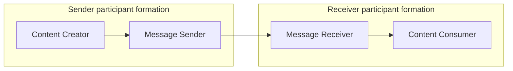

# 2.6.2 Grouped Technical Actors

```mermaid
flowchart LR
  subgraph S[Sender participant formation]
    C[Content Creator] --> M[Message Sender]
  end
  M --> R[Message Receiver]
  subgraph T[Receiver participant formation]
    R --> U[Content Consumer]
  end
```

Logical functions may be implemented by one system or several systems. Receiving a message and consuming its content remain distinguishable activities.
